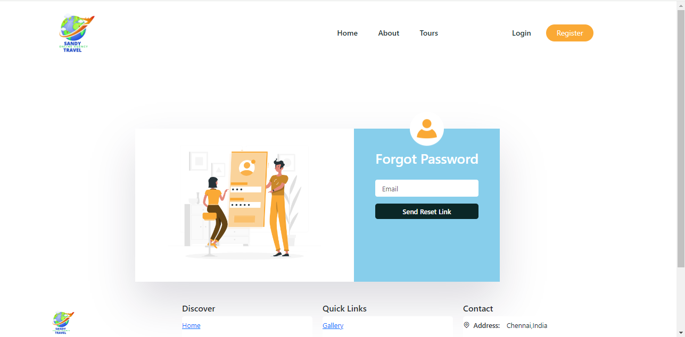
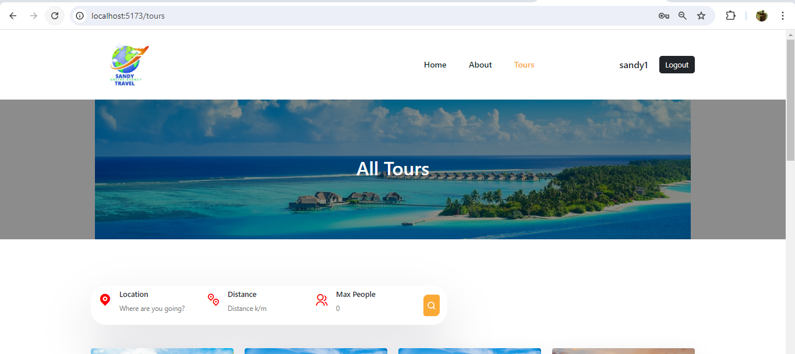
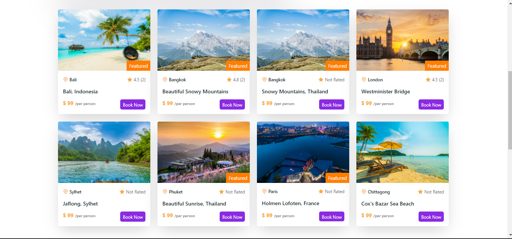
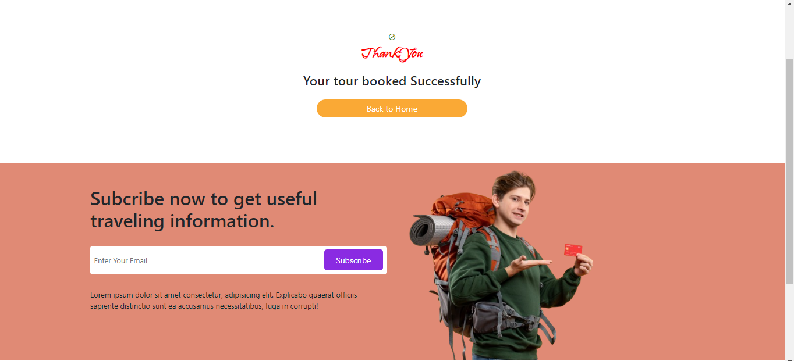

# SandyTravels :
## Description :
- Created a web application to assist users in discovering dream destinations and booking travel tickets.
- Features include view details and description of various destinations, ticket booking, and user reviews.
- Employed Tailwind CSS for designing the user interface of the application.
- Used Context API in ReactJS for user state management within the application.

## Technologies Used :
- ReactJs
- NodeJs
- ExpressJs
- MongoDB
- Reactrap


## Installation :
1. Clone the repository
2. Install dependencies
```
npm install
```
3. Run the application
```
npm run dev
```
4. Open http://localhost:5173 to view it in the browser.

## Screenshots
**Home Page**


**Search Bar**


**FeatureList**


**Login Page**


**Successful Login**


**Register page**


**Forgot Password**


**Reset Password**


**Tour details page**


**Tour Booking**


**Thank you page**


